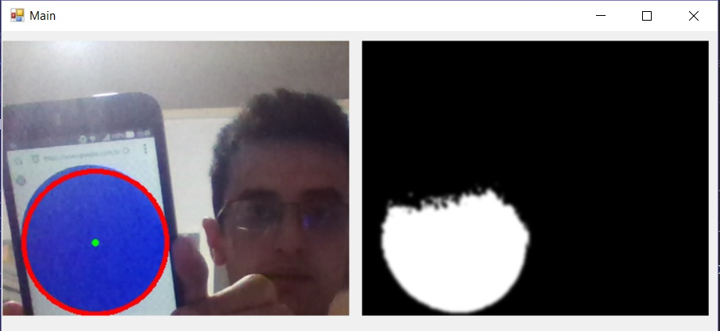

# Live Circle Detector


### Preview



# How to use

## 1st step:
Clone Repository using:
```
> git clone https://github.com/mvakili/ImageProcessing.git
```

## 2nd step:
Open ImageProcessing.sln using Visual Studio

## 3rd step:
Restore missing packages using: 
Tool > NuGet Package Manager > Manage Nuget Packages for Solution

If there is any missing package in solution, the Restore button will be shown at the top-right side of screen. By clicking the Restore button, all missing packages will be restore.

## 4th step:
    Run and enjoy

## License
[MIT](https://github.com/mvakili/ImageProcessing/blob/master/LICENSE)